# DataMarks

## Classes

**DataMarks**

The DataMarks class is a minimal type signature that should be extended by every component that will furnish data and draw shapes based on that data.

#### Required properties

- chart: Chart;
- config: VicDataMarksConfig;
- ranges: Ranges;

#### Required methods

- setPropertiesFromConfig: () => void;
- setPropertiesFromRanges: (useTransition: boolean) => void;
- setValueArrays: () => void;
- drawMarks: () => void;

**VicDataMarksConfig**

#### Required properties

- data: Datum[]
  - an array of type Datum (TS generic) type that contains values to visualize
  - type Datum will be provided by user in specifying the config file for the DataMarks component

#### Required properties - with default values

- mixBlendMode: string
  - default value: 'normal'
  - defines how overlapping elements are blended

## Token

**DATA_MARKS**

The DATA_MARKS token is used as a type specifier and for Angular's dependency injection.

## Expected patterns of use

The below diagram (requires VSCode Markdown Preview Mermaid Support extension) illustrates how a DataMarks component works together with a scaled Chart component to create an expandable system with shared scales that
will update DOM elements when data/te config updates as well as when the chart is resized by the user/browser.

In the diagram, the top olive box represents the component initialization phase. The dark teal box represents the update and draw from a config/data change cycle, and the green box (lowest) represents the update and draw from a chart size change cycle.

Additional components akin to the AxisComponent in the chart can be added ad nauseum, and make use of the updated scales that emit from the ScaledChartComponent, but that are set from the DataMarksComponent.

```mermaid
sequenceDiagram
    participant DataMarksComponent
    participant ScaledChartComponent
    participant AxisComponent
    rect rgb(50, 50, 0)
    Note over DataMarksComponent: Subscribe to scales<br/>Subscribe to ranges
    Note over AxisComponent: Subscribe to scales
    ScaledChartComponent->>DataMarksComponent: Emit ranges
    end
    rect rgb(0, 50, 50)
    Note over DataMarksComponent: Create scales from config / ranges
    DataMarksComponent->>ScaledChartComponent: Update scales
    ScaledChartComponent->>DataMarksComponent: Emit updated scales
    ScaledChartComponent->>AxisComponent: Emit updated scales
    Note over DataMarksComponent: Draw scaled marks
    Note over AxisComponent: Draw scaled axis
    end
    rect rgb(0, 100, 50)
    Note over ScaledChartComponent: Chart gets resized
    ScaledChartComponent->>DataMarksComponent: Emit ranges
    Note over DataMarksComponent: Update scales from config / ranges
    DataMarksComponent->>ScaledChartComponent: Update scales
    ScaledChartComponent->>DataMarksComponent: Emit updated scales
    ScaledChartComponent->>AxisComponent: Emit updated scales
    Note over DataMarksComponent: Draw scaled marks
    Note over AxisComponent: Draw scaled axis
    end
```



### Dump of text that maybe belongs in this doc

These are the only classes that we refer to as "config". If a config requires nested classes, those classes will use different terms than config and generally should name the thing that they do. (BarLabels, QuantitativeDataDimension, etc.). Classes that govern the transformation from a value to a visual variable are referred to as `dimension`. Maps may also have classes referred to as `layer`s that govern the association of specific geojson geometries with visual attributes and, for one `DataLayer`, attribute data. (These layers in turn have dimension objects on them.)

The library exports a class `Vic` which a user can import into their code and use to generate the requisite config(s). That code may look like the following:

```
Vic.barsHorizontal({
  data: filteredData,
  quantitative: Vic.dimensionQuantitative<MetroUnemploymentDatum>({
    valueAccessor: (d) => d.value,
    valueFormat: (d) => this.getQuantitativeValueFormat(d),
    domainPadding: Vic.domainPaddingPixel(),
  }),
  categorical: Vic.dimensionCategorical<MetroUnemploymentDatum, string>({
    range: ['slategray'],
  }),
  ordinal: Vic.dimensionOrdinal<MetroUnemploymentDatum, string>({
    valueAccessor: (d) => d.division,
  }),
  labels: Vic.barsLabels({
    display: true,
  }),
})
```

The set of properties that a user specifies are referred to throughout the library as `options`. These are a subset of properties in the config, are defined as TS interfaces. Configs or other sub-config objects, such as data dimensions, for which a user can specify `options` should `implement` the `options` type. These properties should be `readonly` on the class.

For a config that is input to a Data Marks component, the user will provide, minimally, an array of data, and then a set of specifications for each data dimension of the visualization, each of which will include a `valueAccessor` function and properties that are specific to the functionality of that dimension. The `valueAccessor` is called on items in the `data` array to extract the value relevant for that dimension.

The library provides default values to be used in the case that the user does not specify a property value whenever possible.

Currently, there is no default value for `QuantitativeDimension.valueAccessor` and `DateDimension.valueAccessor`. If a user does not provide values for those properties, an error will be thrown in the console.

### Configuration classes - architecture perspective

For each

A `config` for a Data Marks component (type `VicDataMarksConfig`), with the various data dimension configs it includes, handles all of the parsing and manipulation of the user's data to create values and methods needed for creating a chart. This parsing and setting of properties occurs on class construction. The Data Marks _components_ should never have to manipulate the user's provided data to get the information it needs to draw its marks.

All `VicDataMarksConfig` classes have a method `initPropertiesFromData`, that should be called as the last action in the class's constructor. This method should call all methods needed to unpack the user supplied data and properties to make the properties required for the component to draw its marks.

Typically, this includes passing the data array down to data dimensions so that properties on those classes can be set from the data. Each class of type `VicDataDimension` has a method, `setPropertiesFromData`, which takes the user input data array, extracts dimension-specific values using its `valueAccessor` to a `values` property, and then sets properties specific to that dimension that will be used to draw marks, such as a domain, a range, a scale, and so forth.

Any functionality that requires values from multiple dimensions -- for example, setting the `valueIndices` used to draw marks, should be located on the `config`. Likewise, data dimensions should never handle functionality related to a particular DataMarks component/that is a property of the DataMarks chart in its totality. For example, although the `barsKeyFunction` on the Bars `config` only requires ordinal values, this should exist on the Bars `config` since it is only needed by the `Bars` component, and dimensions are intended to be used across a variety of Data Marks components. (If multiple Data Marks components needed that functionality, then we would likely move it to the ordinal dimension class.)
